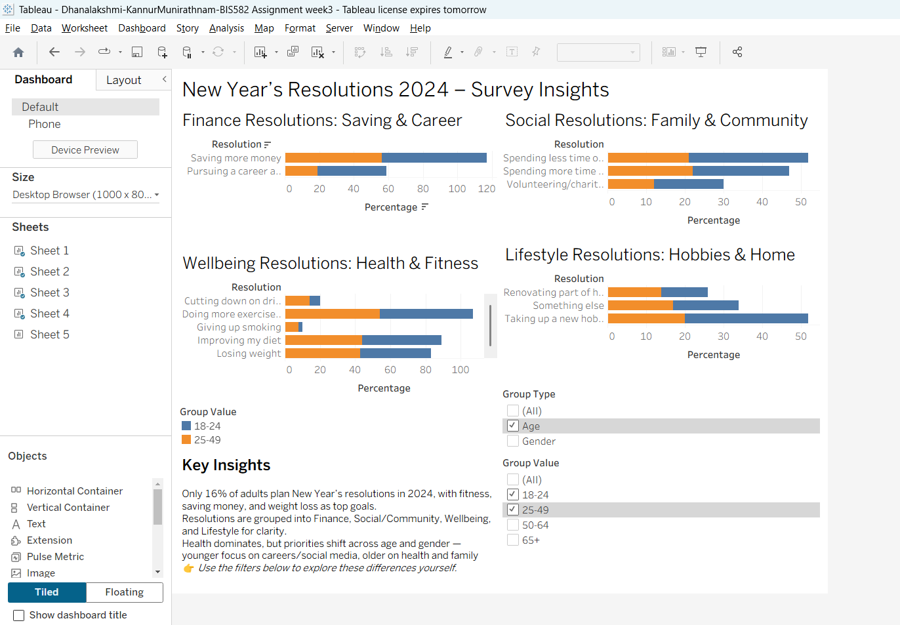
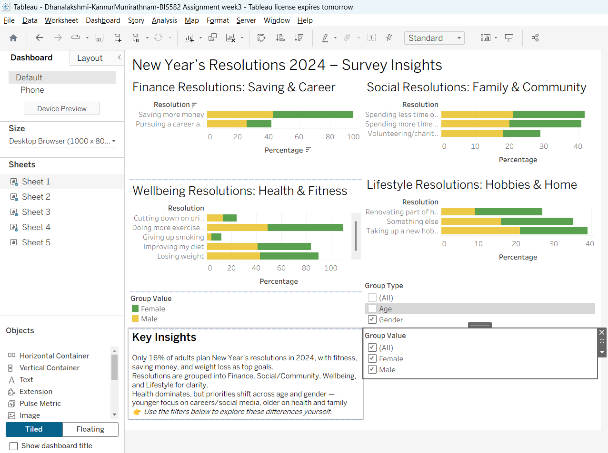

# New Year’s Resolutions 2024 – Survey Insights

**Author:** Dhanalakshmi Kannur Munirathnam   
**Tool:** Tableau  
**Dataset:** YouGov Survey – New Year’s Resolutions 2024 (GB Adults)  

---

## 📊 Project Overview
This dashboard visualizes insights from a **YouGov survey** of 2,054 UK adults conducted 6–7 Dec 2023:contentReference[oaicite:0]{index=0}.  
It highlights how **age and gender** influence the likelihood and type of New Year’s resolutions.

---

## 🎯 Key Insights
- Only **16 % of adults** planned resolutions for 2024; fitness, saving money, and weight loss ranked top.  
- **Younger adults (18–24)** focus on careers and social goals; **older (50+)** prioritize health and family.  
- **Gender patterns:** females lead in wellbeing goals (exercise & diet), males in financial or career ambitions.  
- Resolutions cluster into four themes — Finance, Social, Wellbeing, and Lifestyle — for clear comparison.  

---

## 🗺️ Dashboard Components
1. **Finance Resolutions:** saving money and career growth  
2. **Social Resolutions:** family and community involvement  
3. **Wellbeing Resolutions:** exercise and diet priorities  
4. **Lifestyle Resolutions:** hobbies and home improvement  
5. **Interactive Filters:** by Age and Gender  

---

## 🧠 Tableau Techniques Used
- Parameters & filters to toggle between Age/Gender  
- Grouped dimensions and color legends for clarity  
- Layout containers for 4-quadrant dashboard design (Desktop 1000×800)  
- Reference text block for Key Insights  

---

## 🌐 View Interactive Dashboard
[View on Tableau Public →](https://public.tableau.com/views/Dhanalakshmi-KannurMunirathnam-BIS582Assignment3/Dashboard1?:language=en-US&publish=yes)

---

## 📷 Preview
| Age Filter | Gender Filter |
|-------------|---------------|
|  |  |

---

## 📂 Files
| File | Description |
|------|--------------|
| `Dhanalakshmi-KannurMunirathnam-BIS582_Assignment3.twbx` | Tableau workbook |
| `New_Year_s_Resolutions_Dataset.csv` | Dataset used |
| `YouGov_-_New_Years_resolutions_2024.pdf` | Original YouGov survey reference |
| `Age.png`, `Gender.png` | Dashboard screenshots |

---

## 💡 Reflection
This visualization improved my ability to **organize multi-category data** in a single layout and to design **interactive filters** for comparison by demographics.  
It also demonstrates how to convert survey data into **storytelling dashboards** that highlight behavioral patterns.
